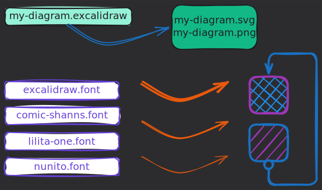

# action-excalidraw-render

Recursively scan a repository for `.excalidraw` files and auto-render them to `.svg` and/or `.png` — fully offline, no excalidraw.com required.



## Usage

```yaml
- uses: ashfordhill/action-excalidraw-render@main
  with:
    format: 'svg'   # svg | png | both  (default: svg)
```

### Inputs

| Input | Description | Required | Default |
|---|---|---|---|
| `format` | Output format: `svg`, `png`, or `both` | No | `svg` |

## Workflow example

Triggers on any push that modifies a `.excalidraw` file or the workflow file itself. The action renders the files; a separate step commits them back.

```yaml
# .github/workflows/excalidraw-render.yml
name: Render Excalidraw

on:
  push:
    paths:
      - '**/*.excalidraw'
      - '.github/workflows/excalidraw-render.yml'
  workflow_dispatch:
    inputs:
      format:
        description: 'Output format'
        required: false
        default: 'svg'
        type: choice
        options: [svg, png, both]

permissions:
  contents: write

jobs:
  render:
    runs-on: ubuntu-latest
    steps:
      - uses: actions/checkout@v4
        with:
          token: ${{ secrets.GITHUB_TOKEN }}

      - uses: ashfordhill/action-excalidraw-render@main
        with:
          format: ${{ inputs.format || 'svg' }}

      - name: Commit rendered files
        run: |
          git config user.email "github-actions[bot]@users.noreply.github.com"
          git config user.name "github-actions[bot]"
          git add -A
          git diff --staged --quiet || git commit -m "chore: render excalidraw files [skip ci]"
          git push
```

## How it works

1. The action spins up two Docker containers on an isolated network:
   - **`excalidraw/excalidraw`** — a self-hosted Excalidraw nginx instance
   - **Renderer** — a Node.js container running [`excalidraw-brute-export-cli`](https://github.com/NicklasHugoy/excalidraw-brute-export-cli) with a headless Firefox (Playwright)
2. The renderer waits for Excalidraw to become healthy, then recursively finds all `*.excalidraw` files in the workspace (skipping `.git`, `node_modules`).
3. Each file is uploaded to the local Excalidraw instance via the browser, exported as SVG/PNG through the UI, and saved alongside the source file.
4. The containers and network are torn down. The workflow step then commits the generated files.

> The `[skip ci]` suffix in the default commit message prevents the render job from triggering itself in a loop.

## Local testing

```sh
INPUT_FORMAT=both docker compose run --rm renderer
```

The included `docker-compose.yml` starts both containers locally. The rendered files are written to the current directory.

## Security

- No calls to `excalidraw.com` or any external service.
- No data leaves your runner.
- Suitable for air-gapped or enterprise environments.
