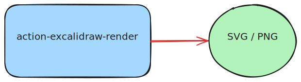

# action-excalidraw-render

Scan `.excalidraw` files in a repository recursively and auto-render them to `.svg` and/or `.png`, then commit the results back — all without using excalidraw.com.



## Usage

```yaml
- uses: your-org/action-excalidraw-render@v1
  with:
    format: 'both'            # svg | png | both  (default: svg)
    github-token: ${{ secrets.GITHUB_TOKEN }}
```

### Inputs

| Input | Description | Required | Default |
|---|---|---|---|
| `format` | Output format: `svg`, `png`, or `both` | No | `svg` |
| `github-token` | GitHub token for committing rendered files | Yes | — |
| `commit-message` | Commit message for the render commit | No | `chore: render excalidraw files [skip ci]` |
| `committer-name` | Git committer name | No | `github-actions[bot]` |
| `committer-email` | Git committer email | No | `github-actions[bot]@users.noreply.github.com` |

## Workflow example

The included workflow triggers on any push that modifies a `.excalidraw` file or the workflow file itself:

```yaml
# .github/workflows/excalidraw-render.yml
name: Render Excalidraw

on:
  push:
    paths:
      - '**/*.excalidraw'
      - '.github/workflows/excalidraw-render.yml'
  workflow_dispatch:
    inputs:
      format:
        description: 'Output format'
        required: false
        default: 'svg'
        type: choice
        options: [svg, png, both]

permissions:
  contents: write

jobs:
  render:
    runs-on: ubuntu-latest
    steps:
      - uses: actions/checkout@v4
        with:
          token: ${{ secrets.GITHUB_TOKEN }}

      - uses: ./
        with:
          format: ${{ inputs.format || 'svg' }}
          github-token: ${{ secrets.GITHUB_TOKEN }}
```

## How it works

1. The action is packaged as a **Docker image** so it runs in a fully isolated, reproducible environment.
2. On startup it recursively searches `GITHUB_WORKSPACE` for all `*.excalidraw` files (skipping `.git` and `node_modules`).
3. Each file is converted using the **[excalidraw-to-svg](https://github.com/JRJurman/excalidraw-to-svg)** Node.js library, which uses the Excalidraw library with a jsdom DOM — **no browser, no excalidraw.com**.
4. For PNG output the resulting SVG is rasterised with **[@resvg/resvg-js](https://github.com/yisibl/resvg-js)** (Rust-based, no system dependencies).
5. All generated files are staged and committed back to the branch using the provided `github-token`.

> The `[skip ci]` suffix in the default commit message prevents the render job from triggering itself in an infinite loop.

## Security

This action is fully self-contained:
- No calls to `excalidraw.com` or any external service.
- No data leaves your runner.
- Suitable for air-gapped or enterprise environments.
